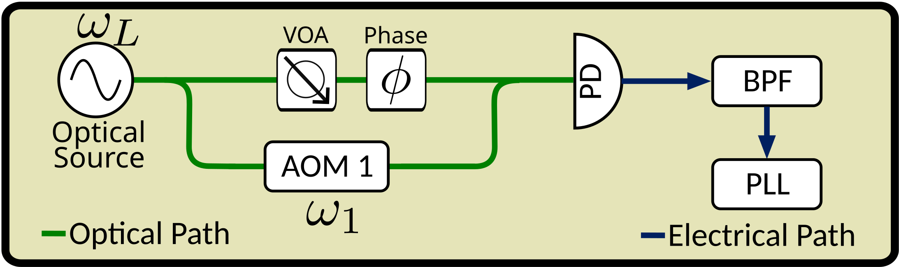
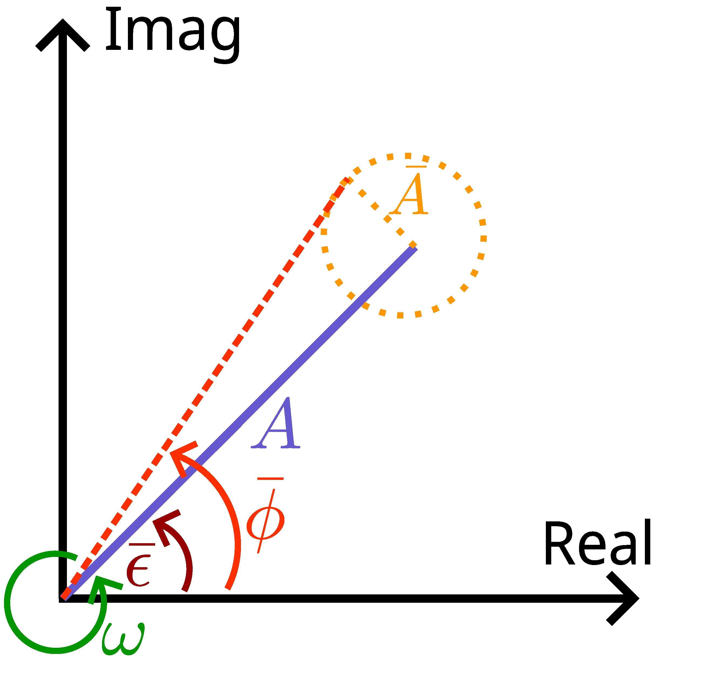

# Weak Light Tracking Seminar

## Helper Code

<figure style='text-align:center;'></figure>

**
Figure 1:** Simplified weak-light optical experiment. $\omega_L$, optical source frequency (193 THz for our case); AOM, acousto-optic modulator; $\omega_1$, AOM frequency shift; VOA, variable optical attenuator; $\omega_2$, VOA frequency shift; PD, photodetector; 
$\phi$, some phase shift that is our signal of interest; BPF, band-pass filter; PLL, phase-locked loop

At the photodetector, the electric field of light is given by the following equation:

$$ E_{PD}(t) = \sqrt{P_{LO}}e^{j\omega_Lt+\omega_1 t} + \sqrt{P_{sig}}e^{j\omega_Lt+\phi}$$

where $P_{LO}$ is the power of the local oscillator (optical source in Figure 1), $P_{sig}$ is the power of the signal (optical power after attenuation), $\omega_L$ is the frequency of the optical local oscillator, $\omega_1$ is the frequency of the AOM, and $\phi$ is some phase shift that we want to measure.

In this simplified example, we have a weak optical signal, such that $P_{sig} \ll P_{LO}$, that encoded useful information in $\phi$. Weak-light tracking has applications in:
- Future gravitational wave missions such as GRACE. Where interspacecraft laser interferometry is used to measure the change in displacements between spacecrafts, with the goal of measuring gravitational waves.
- Frequency modulated and phase modulate continuous wave LiDAR systems. Where the phase shift of the signal is used to measure the distance between the optical source and the target. Usually this is through stray reflections of the signal, and is likely to be weak light.
- For our purposes, we want to compare the stability of optical clocks from ground to space. This will involve transmitting the optical reference signal from the ground to a satellite, and measuring the phase shift of the signal at the spacecraft, and vice-versa.

With the context in mind, we can begin to analyse the simplified experiment.

For a square-law detector, the photodetector can only responds to:

$$ P_{OPT} = |E_{PD}|^2 = P_{LO} + P_{sig} + 2\sqrt{P_{LO}P_{sig}}cos(\omega_1t+\phi)$$

The photocurrent generated by the photodetector is given by:

$$ \bar{I} = \bar{I}_{LO} + \bar I_{sig} + 2\sqrt{\bar{I}_{LO}\bar{I}_{sig}}cos(\omega_1t+\phi)$$

This photocurrent is made up of a DC offset $\bar{I}_{LO}+\bar{I}_{sig}$, where $\bar{I}_{LO}$ is the noisy LO current, and $\bar{I}_{sig}$ is the noisy signal current. The second term is the AC component of the photocurrent, which contains our signal of interest $\phi$, which will also have its own noise properties. The photocurrent will be converted to a measurable voltage with a transimpedance amplifier. For the purposes of this seminar, we don't need to consider the amplifier, as we only care about the noise properties of our signals. We will come back to this equation later, and how the noise properties are defined, for now let's consider how noise sources affect the signal.

The two noise types we will consider are:
- Additive noise: The noise that is added on to our signal of interest, which is just amplitude noise.
- Phase noise: The noise that affects the phase of our signal of interest.

A simplified model of the noise sources is given by:

$$v(t)=A\cos(\omega t + \theta + \bar{\phi}(t)) + \bar{A}(t)$$

where $v(t)$ is the voltage of the signal input to our phase measurement device, $A$ is the amplitude of the signal, $\omega$ is the frequency of the signal, $\theta$ is the phase of the signal, $\bar{\phi}(t)$ is the phase noise, and $\bar{A}(t)$ is the amplitude noise. We can usually lump the phase we're interested in measuring, and its noise together.

A phase-locked loop (PLL) can be used to measure the phase of the signal, however, care must be taken in considering how $\bar{\phi}(t)$ and $\bar{A}(t)$ couple in to our measurement. To illustrate this, consider the diagram:

<figure style='text-align:center;'></figure>

**
Figure 3:** Phasor diagram of the noisy measurement signal. $\omega$, the rate at which our phasor spins; $\phi$, the phase shift we are trying to measure; $\bar\theta$ the phase offset of the noisy measurement signal; $A$, the amplitude (magnitude) of the measurement signal; 
$\bar A$, the additive amplitude noise in the measurement signal.

To avoid confusion, the phasor model can be separated into its time varying component and its phase component (ignoring additive noise):

$$ v(t) = \Re(Ae^{j\omega t}e^{j\phi})$$

and the PLL measurement will be given by:

$$ v(t) = \text{Arg}(Ae^{j\omega t}e^{j\phi}\times e^{-j\omega t})=\phi$$

There are a few ways to figure out how $\bar A$ will couple into the phase measurement from the PLL. I'm going to run through a derivation that uses the Hilbert transform, as it is essentially a mathematical description of the phasor diagram above. The goal is to find how the noise output, $S_{PLL}(f)$, depends on the phase noise $S_{\bar\phi}(f)$ and the additive noise $S_{\bar A}(f)$, where $S(f)$ is the noise power spectral density.

While not technically defined, this derivation will use:

$$S(f)=\lim_{T\rightarrow\infty}\frac{1}{T}|\mathcal{F}(x(t))|^2$$

where $\mathcal{F}$ is the Fourier transform, and $x(t)$ is the signal of interest. A more rigorous approach would be to consider the auto-correlation of our signals.

Considering our noise model,
$$v(t) = A cos(\omega_i t + \theta_i + \bar{\epsilon}(t))+\bar{A}(t)$$
Take the Hilbert transform,
$$\mathscr{H}\{v(t)\}=Asin(\omega_i t + \theta_i + \bar{\epsilon}(t))+\mathscr{H}\{\bar{A}(t)\}$$
Form the analytic signal,
$$u(t) = A cos(\omega_i t + \theta_i + \bar{\epsilon}(t))+\bar{A}(t) + j[Asin(\omega_i t + \theta_i + \bar{\epsilon}(t))+\mathscr{H}\{\bar{A}(t)\}]$$
The instantaneous phase $\bar{\phi}(t)$ is given by the argument of this analytic signal (which is the phase of the phasor drawn in Figure 2),
$$\bar{\phi}(t) = \tan^{-1} [\frac{Asin(\omega_i t + \theta_i + \bar{\epsilon}(t))+\mathscr{H}\{\bar{A}(t)\}}{A cos(\omega_i t + \theta_i + \bar{\epsilon}(t))+\bar{A}(t)}]$$
For small $x,y$ it can be shown using a taylor expansion of $x$ and $y$
that,
$$tan^{-1}[\frac{sin(\alpha)+x}{cos(\alpha)+y}]\approx \alpha + x cos(\alpha) - y sin(\alpha)$$
from which it follows for small noise fluctuations $\bar{A}(t)$ that,
$$\bar{\phi}(t) = \omega_i t + \theta_i + \bar{\epsilon}(t) + \frac{\mathscr{H}\{\bar{A}(t)\}}{A}\cos(\omega_i t + \theta_i + \bar{\epsilon}(t)) - \frac{\bar{A}(t)}{A}\sin(\omega_i t + \theta_i + \bar{\epsilon}(t))$$
We can ignore the contribution from the frequency and static offset,
providing $$\begin{aligned}
    \bar{\phi(t)}=\bar{\epsilon}(t)+\frac{\mathscr{H}\{\bar{A}(t)\}}{A}\cos(\omega_i t + &\theta_i + \bar{\epsilon}(t)) - \frac{\bar{A}(t)}{A}\sin(\omega_i t + \theta_i + \bar{\epsilon}(t))\\
    \bar{\phi(t)} &= \bar{\epsilon}(t)+ A'(t)
\end{aligned}$$ From this it is clear that, $$\begin{aligned}
    S_{\phi,\epsilon}(f)=S_{\epsilon}(f)
\end{aligned}$$ which is expected. 

It is a bit more involved to work out the contribution from the additive noise. Let's just consider the additive noise now,

$$ \bar{\phi(t)}=\frac{\mathscr{H}\{\bar{A}(t)\}}{A}\cos(\omega_i t + \theta_i + \bar{\epsilon}(t)) - \frac{\bar{A}(t)}{A}\sin(\omega_i t + \theta_i + \bar{\epsilon}(t)) $$

Using the property of the Hilbert transform $\mathcal{F}(\mathcal{H}(x(t)))=-j \mathcal{F}(x(t))$,

$$ \mathcal{F}(\bar{\phi}(t)) = \mathcal{F}\{\frac{\mathcal{H}\{\bar{A}(t)\}}{A}\cos(\omega_i t + \theta_i + \bar{\epsilon}(t))\} + \mathcal{F}\{-\frac{\bar{A}(t)}{A}\sin(\omega_i t + \theta_i + \bar{\epsilon}(t))\} $$

Which when using the convolution property,

$$ \mathcal{F}(\bar{\phi}(t)) = \mathcal{F}\{\frac{\mathcal{H}\{\bar{A}(t)\}}{A}\} \ast \mathcal{F}\{\cos(\omega_i t + \theta_i + \bar{\epsilon}(t))\} + \mathcal{F}\{-\frac{\bar{A}(t)}{A}\} \ast \mathcal{F}\{\sin(\omega_i t + \theta_i + \bar{\epsilon}(t))\} $$
$$ \mathcal{F}(\bar{\phi}(t)) = -j\frac{\mathcal{F}\{\bar{A}(t)\}}{A} \ast \frac{1}{2}[\delta(f-f_i)+\delta(f+f_i)] + \mathcal{F}\{\frac{\bar{A}(t)}{A}\} \ast \frac{1j}{2}[-\delta(f-f_i)+\delta(f+f_i)] $$

Define $\bm{A}(f)=\mathcal{F}\{\bar A(t)\}$,

$$ \mathcal{F}(\bar{\phi}(t)) = \frac{1}{2A}[-j\bm{A}(f-f_i)-j\bm{A}(f+f_i)-j\bm{A}(f-f_i)+j\bm{A}(f+f_i)]=\frac{-1j}{A}\bm{A}(f-f_i) $$

Jumping a step, we can write the power spectral density of the phase noise as,

$$ S_{\phi, A}(f) = \frac{1}{A^2} S_{\bar A}(f-f_i)$$

For our case, we only want to consider the single sided PSD, so we can write,

$$ S_{\phi, A}(f) = \frac{2}{A^2} S_{\bar A}(f)$$

**Discuss the implications of this equation! Think about SNR.**

